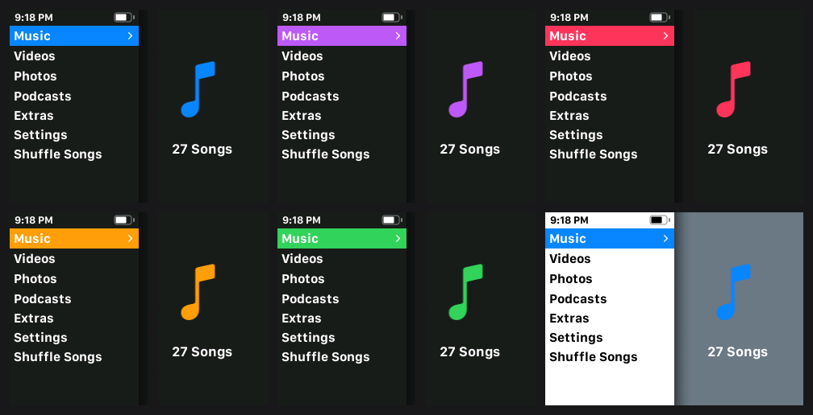
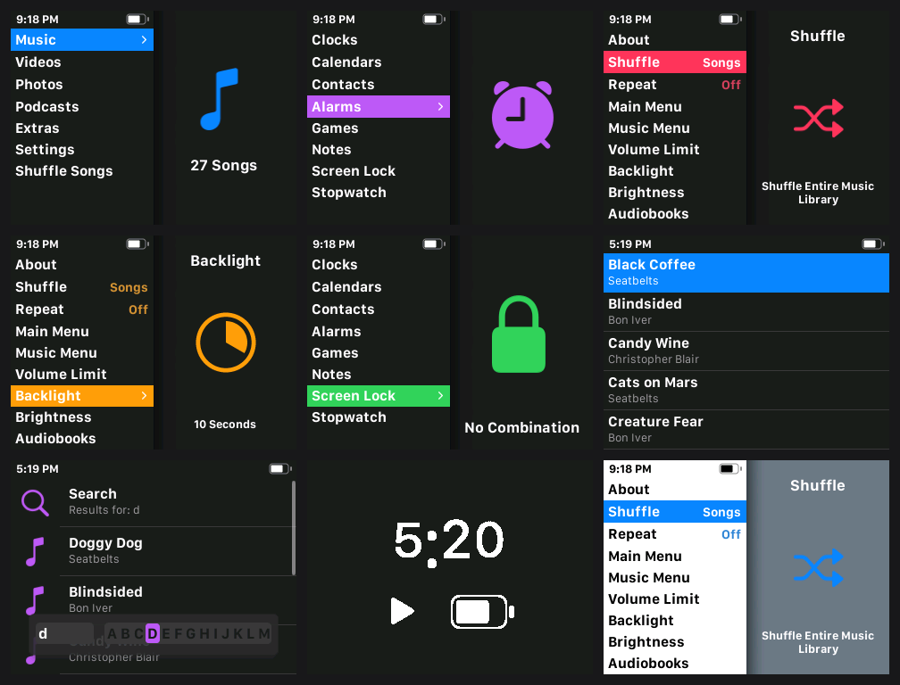

# iPod Classic FLAC OS

Apple's iPod Classic 7G firmware 2.0.4, extended with C code linked into the image:

- FLAC playback (up to 24-bit/192 kHz, decimated and dithered to 16/48)
- an on-device library sync: copy album folders into `Music/`, eject, and the library updates,
  play counts and ratings survive renames
- album art from cover files or embedded pictures, kept in one database file
- Light, Dark and Automatic (sunset/sunrise) themes with accent colours, switched live
- Theme, Accent Colour and Library rows in Apple's own Settings menu
- a self-updater: drop a new image on the disk and restart
- boots straight from the firmware partition through a Rockbox-derived bootloader; Apple's
  hibernate (instant-on) works with it

How it works, address by address: [docs/CODEBASE.md](docs/CODEBASE.md).
Every byte changed in Apple's image: [ospatch/HOOKS.md](ospatch/HOOKS.md).

## Screenshots

The Modern style: flat bars, large accent icons, SF Compact text. Dark with five of the eight
accent colours, and Light (bottom right):



Around the menus: Extras, Settings, a song list, Search and the hold screen while music plays:



Single screens at twice the iPod's resolution are in [docs/screenshots](docs/screenshots). They
are taken in the QEMU model (tools/qemu); the model does not draw Now Playing's text, so that
screen is not shown.

## Layout
- `runtime/` the code linked into the OS ("region E"); `runtime/flac/` playback and art;
  `runtime/host/` Mac-side generators and checks
- `libsync/` the iTunesDB sync, its host build and tests
- `ospatch/` the image patcher and checker, firmware partition tool
- `bootloader/` our bootloader source (`ipod-s5l87xx.c`, a modified Rockbox file; `.stock` is the original)

## Requirements
Apple's decrypted `Firmware-35.9.0.4.osos.dec` (not included), the Arm GNU toolchain
(`arm-none-eabi`; `runtime/build.sh` looks in `build/` or `$ARM_TOOLCHAIN`), Python 3, clang, `mks5lboot` for the bootloader.

## Build
```
PYTHONPATH=runtime/host python3 runtime/host/gen_settings.py ospatch/Firmware-35.9.0.4.osos.dec \
    runtime/settings_data.h runtime/settings_data.json
runtime/build.sh
python3 ospatch/mkpatch18.py --base stock --image ospatch/Firmware-35.9.0.4.osos.dec \
    --e runtime/e.bin --syms runtime/e.syms --out ospatch/osos-v18.dec --hooks all --governor-floor
python3 ospatch/checkpatch.py ospatch/osos-v18.dec runtime/e.bin runtime/e.syms all
```

## Install an update
Copy `ospatch/osos-v18.dec` to the iPod as `/osos-update.dec` and `/osos-v18.dec`, eject, restart.
The OS writes itself into the firmware partition and restarts once.

## Using it
- Music goes in `Music/<album>/`, m3u playlists in `Playlists/`. The library updates at boot and
  after every USB session; Settings > Library > Sync library now forces a pass.
- At power-on: PLAY held = Rockbox, MENU = Apple's stock OS.
- `FLAC\rtlog.txt` on the disk is the log (sync results, a library health line, boot timeline).

## Tests
See section 13 of [docs/CODEBASE.md](docs/CODEBASE.md); none of them need the iPod.
